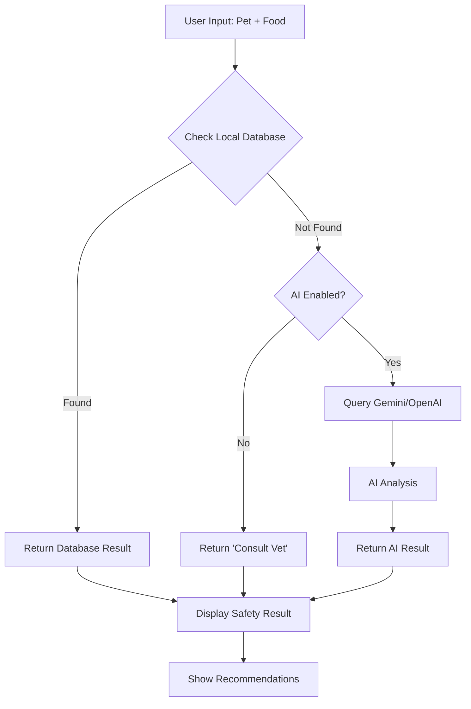

# 🔬 PetPal Food Safety Detection Flow

## Process Overview

## Safety Categories

| Category | Icon | Description | Action |
|----------|------|-------------|---------|
| **Safe** | ✅ | Generally safe for the pet | Can feed in normal amounts |
| **Caution** | ⚠️ | Safe in moderation | Consult vet, feed sparingly |
| **Unsafe** | ❌ | Potentially harmful | Avoid completely |
| **Unknown** | ❓ | No data available | Consult veterinarian |

## Data Sources Priority

1. **ManyPets Database** (Primary) - 570+ verified entries
2. **ASPCA Guidelines** (Secondary) - Additional references  
3. **AI Analysis** (Fallback) - For unknown foods
4. **Veterinary Consultation** (Ultimate) - When in doubt

## Response Time

- **Database Lookup**: < 50ms
- **AI Analysis**: 1-3 seconds
- **Total Response**: Usually under 3 seconds

## Accuracy Levels

- **Known Foods**: 95%+ accuracy (veterinary verified)
- **AI Analysis**: 85%+ accuracy (constantly improving)
- **Edge Cases**: Always recommend veterinary consultation
